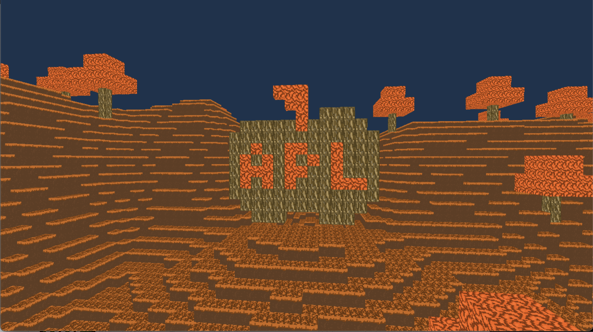

# A Voxel Game

This started off of as a bet with myself that APL notation would make an easier way to make a voxel game.

This is highly experimental and buggy.

## Controls

- W-A-S-D to move
- Space to jump
- Mouse to move the camera
- Q to quit

# Requirements

- Dyalog APL 20.0
- A C Compiler
- CMake
- sdl3 and sdl3_image (MacOS with `brew`)

This has only been done on MacOS, but Linux should work out of the box.

After installing, make sure you build and install LSE.
e.g.,
```
cd lse 
mkdir build
cd build
cmake ..
make 
make install
```

This should install `libLSE.dylib` on macOS and `libLSE.so` on Linux in `./libs/`.

You should be able to run it by doing `./main.apls` after this.

## Compiling Shaders

Source code that gets compiled to different shader formats is in `./shaders/glsl`

Shaders come bundled with this repo. However, if you want to modify them, edit the glsl ones and run `./compile_shaders` 

Note that this requires glslc and spirv-cross.