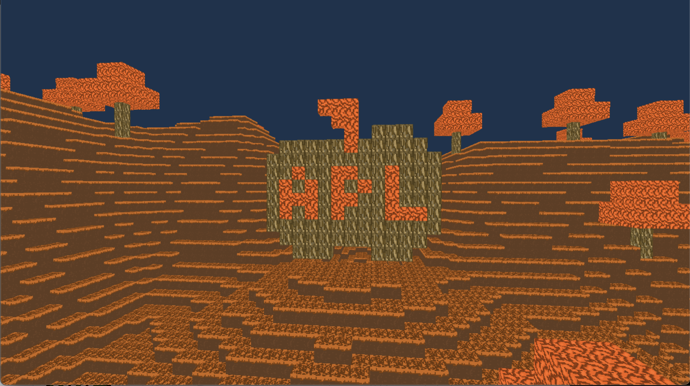

# A Voxel Game

This started off as a bet with myself that APL notation would provide an easier way to make a voxel game.

This is highly experimental and buggy.

## Controls

- W-A-S-D to move
- Space to jump
- Mouse to move the camera
- Q to quit
- I to toggle render information
- F for fast noclip mode
- 1-5 to select different blocks to place

# Requirements

- Dyalog APL 20.0
- A C Compiler
- CMake
- Vulkan, DirectX12 or Metal graphics are required. For more information, check [here](https://wiki.libsdl.org/SDL3/CategoryGPU#system-requirements)
- sdl3, sdl3_ttf and sdl3_image (MacOS with `brew`)

# Instructions

## Running on MacOS or Linux

After installing dependencies and cloning, make sure you build and install LSE.
e.g.,
```
cd lse 
mkdir build
cd build
cmake ..
make 
make install
```

This should install `libLSE.dylib` on macOS and `libLSE.so` on Linux in `./libs/` alongside the relevant SDL3 library files. 

After that you should be able to run with `./main.apls`

Some Linux users may have `dyalogscript` located in a different directory. If that's the case, the shebang in `main.apls` should be replaced with the path specified by `which dyalogscript`

## Running on Windows (WIP)

Compiling everything on Windows is a bit more tricky and is best done with finding the SDL3 dev libraries provided on libsdl3 releases with cmake-gui (there are issues with SDL3 through vcpkg). 

Otherwise, .dlls should be provided as releases in the future which contains .dlls which should be placed in `./libs/`

Afterwards, the game can be played through a Dyalog session like so:

```apl
]cd <ROOT DIRECTORY>
]link.create # ./avg
Run
state.Play
```

# Compiling Shaders

Source code that gets compiled to different shader formats is in `./shaders/glsl`

Shaders come bundled with this repo. However, if you want to modify them, edit the glsl shaders and run `./compile_shaders.sh` 

Note that this requires the DirectX Shader Compiler, glslc and spirv-cross.

# Known Issues

- There are significant performance regressions on Windows being worked on.
- DirectX12 backend is currently not supported on Windows.
- You currently can't play multiple times in the same session.
    - Known to syserror 999 !
    - There's probably memory leaks somewhere !